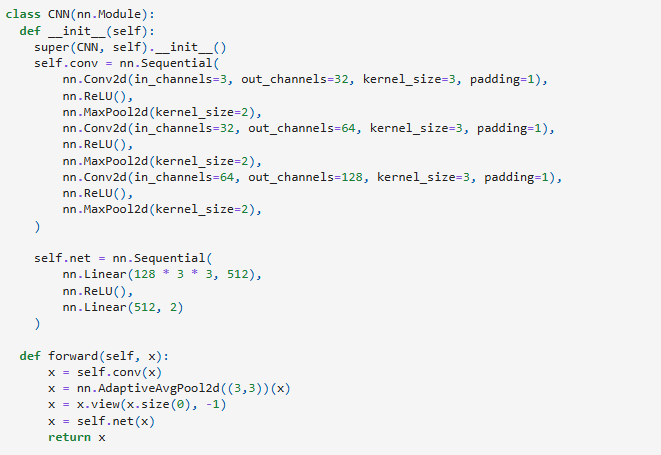
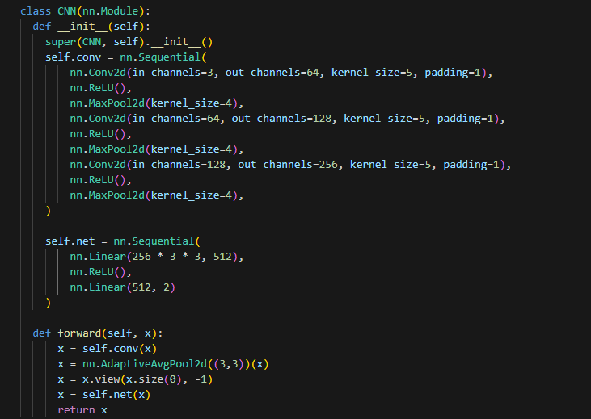
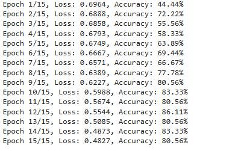
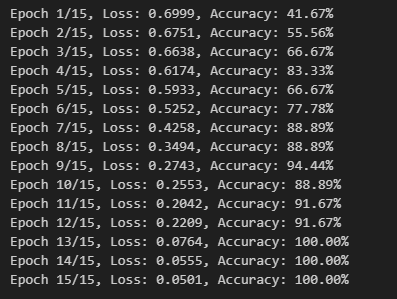
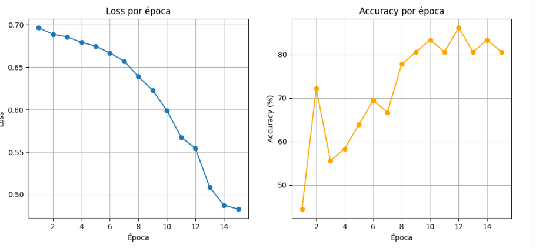
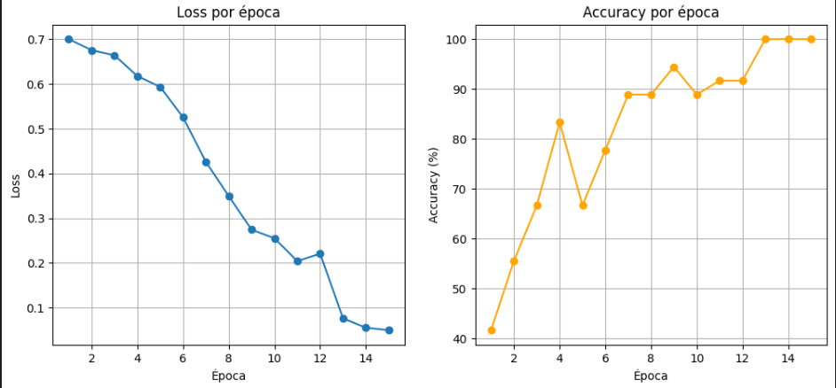

# Detección de alimentos en mal estado
## Instalación
1. Clona el repositorio

```bash
    git clone https://github.com/MarceloOrtegaDev/tp-evaluativo-CNN-alimentos.git
```

2. Crea un entorno virtual e instala los requerimientos
```bash
    python -m venv venv
```
```bash
    pip install -r requirements.txt
```

3. Instalar el kernel y ejecutar todo el jupyter notebook

## Informe
* Tras finalizar el modelo lo primero que hice fue observar todas las métricas obtenidas, perdida, porcentaje de acierto del modelo etc, El modelo se entrenó en aproximadamente un 83% de exactitud y ya funcionaba para predecir correctamente todo tipo de imágenes de alimentos
* Luego de subir el repositorio empecé a hacer pruebas para ver que pasaba si le quitaba menos filtros por capas pasando de 64 a 128 y luego a 256 permitiendo que la red aprenda más características de las imágenes, desde bordes y texturas hasta patrones más complejos.




* El resultado fue algo que no esperaba, al ver como la perdida iba disminuyendo y la exactitud se elevaba muchísimo más al pasar las épocas




* Esto se vió reflejado en los gráficos




* En fín, el resultado fue mejor de lo que esperaba y si no hacía estas pruebas quizás no iba a saber que el modelo CNN podía mejorar tanto con unas configuraciones mínimas

## Hablando de la comparación entre el modelo CNN y el modelo MLP

* Para el modelo MLP busqué un dataset distinto de MNIST y encontré uno llamado CIFER10 que contiene imágenes tanto de animales, como de vehiculos, básicamente reciclé el tp anterior pero ajustandolo a la nueva necesidad del dataset

### ¿ Qué diferencias encontré y cuál me pareció mejor ?

* En mí opinión el modelo CNN es mejor que el modelo MLP ya que el modelo CNN Aprovecha la estructura espacial de la imagen. Detecta características locales (manchas, colores, formas) y generaliza mejor. Además leí que normalmente tendrá mayor accuracy y menor overfitting que un MLP para el mismo dataset de imágenes.

* En cuanto al MLP puede aprender a distinguir alimentos en buen/mal estado si las imágenes son muy simples al igual que un CNN pero se vuelve ineficiente y menos preciso con imágenes más grandes o con patrones complejos (manchas, texturas).


